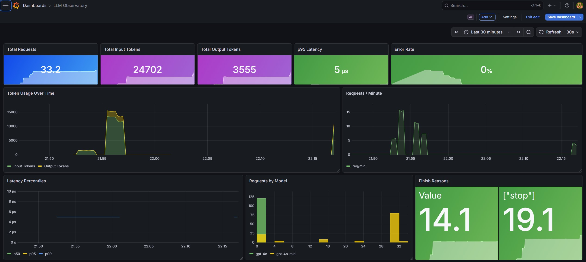

# llm-otel-proxy

> **Zero-code LLM observability. Drop it in front of OpenAI or Anthropic, change one env var, done.**

[](LICENSE)
[](https://www.python.org/)
[](https://opentelemetry.io/docs/specs/semconv/gen-ai/)
[](docker-compose.yml)

---

Every LLM observability tool today asks you to wrap your SDK:

```python
# What every tool asks you to do
with langfuse.trace() as t:
    response = client.chat.completions.create(...)  # 😩 touching every callsite
```

**This one doesn't.** It's a transparent proxy. Point your `base_url` at it, and every call is automatically traced — tokens, latency, model, finish reason — with zero changes to application code.

```bash
# Before
OPENAI_BASE_URL=https://api.openai.com

# After — that's literally it
OPENAI_BASE_URL=http://localhost:4000/openai
```

---

## What you get

A full **LLM Observatory** dashboard out of the box:



| Panel | What it shows |
|---|---|
| **Total Requests** | Span count across the selected time window |
| **Total Input Tokens** | Cumulative prompt tokens consumed |
| **Total Output Tokens** | Cumulative completion tokens generated |
| **p95 Latency** | 95th-percentile end-to-end latency |
| **Error Rate** | % of requests returning non-2xx |
| **Token Usage Over Time** | Input/output tokens as a time series |
| **Requests / Minute** | Live request rate |
| **Latency Percentiles** | p50 / p95 / p99 over time |
| **Requests by Model** | Breakdown by model name |
| **Finish Reasons** | stop / length / content_filter distribution |

Every LLM call also produces a full distributed trace in Grafana Tempo with all [OpenTelemetry GenAI semantic convention](https://opentelemetry.io/docs/specs/semconv/gen-ai/) attributes:

```
Span: openai.chat  [200 OK, 1.4s]
  gen_ai.system                  = openai
  gen_ai.request.model           = gpt-4o
  gen_ai.response.model          = gpt-4o-2024-08-06
  gen_ai.usage.input_tokens      = 1176
  gen_ai.usage.output_tokens     = 312
  gen_ai.response.finish_reasons = ["stop"]
  http.response.status_code      = 200
  server.address                 = api.openai.com
```

---

## Quickstart

### Prerequisites

- [Docker](https://docs.docker.com/get-docker/) and [Docker Compose](https://docs.docker.com/compose/install/) (v2+)
- An OpenAI or Anthropic API key

### Step 1 — Clone and start the stack

```bash
git clone https://github.com/JoshBuch/llm-otel-proxy.git
cd llm-otel-proxy
docker compose up
```

Wait ~15 seconds for all services to be healthy. You'll see log lines from `sidecar`, `otel-collector`, `tempo`, `prometheus`, and `grafana`.

### Step 2 — Open the dashboard

Navigate to **[http://localhost:30025](http://localhost:30025)** and log in with `admin` / `admin`.

The **LLM Observatory** dashboard is pre-provisioned — no setup needed.

| Service | URL | Purpose |
|---|---|---|
| **Proxy** | `http://localhost:4000` | Drop-in LLM endpoint |
| **Grafana** | `http://localhost:30025` | Pre-built dashboard (admin/admin) |
| **Tempo** | `http://localhost:3200` | Distributed trace storage |
| **Prometheus** | `http://localhost:9090` | Span metrics |

### Step 3 — Point your app at the proxy

Set the base URL environment variable — **no other changes to your code**:

```bash
# OpenAI
export OPENAI_BASE_URL=http://localhost:4000/openai/v1
export OPENAI_API_KEY=sk-...

# Anthropic
export ANTHROPIC_BASE_URL=http://localhost:4000/anthropic
export ANTHROPIC_API_KEY=sk-ant-...
```

### Step 4 — Make a call and watch it appear

```bash
curl http://localhost:4000/openai/v1/chat/completions \
  -H "Authorization: Bearer $OPENAI_API_KEY" \
  -H "Content-Type: application/json" \
  -d '{"model":"gpt-4o","messages":[{"role":"user","content":"Hi"}]}'
```

Within seconds, the Grafana dashboard updates with token counts, latency, and a trace in Tempo.

---

## Works with every LLM SDK and language

**Python — OpenAI**
```python
import os
from openai import OpenAI

client = OpenAI(
    api_key=os.environ["OPENAI_API_KEY"],
    base_url="http://localhost:4000/openai/v1",  # only change
)
response = client.chat.completions.create(
    model="gpt-4o",
    messages=[{"role": "user", "content": "Hello"}],
)
print(response.choices[0].message.content)
```

**Python — Anthropic**
```python
import os
import anthropic

client = anthropic.Anthropic(
    api_key=os.environ["ANTHROPIC_API_KEY"],
    base_url="http://localhost:4000/anthropic",  # only change
)
message = client.messages.create(
    model="claude-opus-4-5",
    max_tokens=1024,
    messages=[{"role": "user", "content": "Hello"}],
)
print(message.content[0].text)
```

**TypeScript / Node.js**
```typescript
import OpenAI from "openai";

const client = new OpenAI({
  apiKey: process.env.OPENAI_API_KEY,
  baseURL: "http://localhost:4000/openai/v1",  // only change
});

const response = await client.chat.completions.create({
  model: "gpt-4o",
  messages: [{ role: "user", content: "Hello" }],
});
```

**curl**
```bash
curl http://localhost:4000/openai/v1/chat/completions \
  -H "Authorization: Bearer $OPENAI_API_KEY" \
  -H "Content-Type: application/json" \
  -d '{"model":"gpt-4o","messages":[{"role":"user","content":"Hi"}]}'
```

---

## Architecture

```
┌──────────────────────────────────────────────────────┐
│  Your application  (any language, any LLM SDK)        │
│  OPENAI_BASE_URL=http://localhost:4000/openai         │
└───────────────────────┬──────────────────────────────┘
                        │ unchanged HTTP request
                        ▼
┌──────────────────────────────────────────────────────┐
│  llm-otel-proxy  (FastAPI + httpx)                   │
│                                                      │
│  Proxy ──▶ Parser ──▶ OTel Emitter (OTLP gRPC)      │
│     │         └─ ParsedSpan (semconv fields)         │
│     │ forward                       │ spans          │
└─────┼─────────────────────────────-─┼────────────────┘
      │                               │
      ▼                               ▼
 OpenAI / Anthropic        OTel Collector (contrib)
                              │              │
                              ▼              ▼
                           Tempo        Prometheus
                         (traces)    (span metrics)
                              └──────┬───────┘
                                     ▼
                                  Grafana
                           (LLM Observatory dashboard)
```

**Key design invariants:**
- **Streaming is never buffered.** Chunks are forwarded to the client immediately; a side-copy is accumulated for telemetry after the stream ends.
- **Telemetry is fire-and-forget.** Span emission runs in a background task and never delays or fails the response.
- **Byte-for-byte passthrough.** Status code, headers, and body are identical to what the upstream returned.

---

## Configuration

All configuration is via environment variables — no config files to edit.

| Variable | Default | Description |
|---|---|---|
| `SIDECAR_PORT` | `4000` | Port the proxy listens on |
| `OTLP_ENDPOINT` | `http://localhost:4317` | OTLP gRPC collector endpoint |
| `OPENAI_UPSTREAM` | `https://api.openai.com` | OpenAI upstream base URL |
| `ANTHROPIC_UPSTREAM` | `https://api.anthropic.com` | Anthropic upstream base URL |
| `LOG_LEVEL` | `INFO` | Python log level |
| `CAPTURE_PROMPTS` | `false` | Attach full prompt/completion text as span events (privacy opt-in) |

### Capturing prompt content

```bash
CAPTURE_PROMPTS=true docker compose up
```

This adds `gen_ai.content.prompt` and `gen_ai.content.completion` span events visible in Tempo traces. **Off by default** — enable only in environments where storing prompt content is acceptable.

---

## Send traces to your existing backend

The proxy emits spans via standard OTLP gRPC. Set `OTLP_ENDPOINT` to route to any collector:

```bash
# Grafana Cloud
OTLP_ENDPOINT=https://otlp-gateway-prod-eu-west-0.grafana.net/otlp

# Honeycomb
OTLP_ENDPOINT=https://api.honeycomb.io:443
# + OTEL_EXPORTER_OTLP_HEADERS="x-honeycomb-team=<api-key>"

# Datadog Agent
OTLP_ENDPOINT=http://datadog-agent:4317

# Jaeger (all-in-one)
OTLP_ENDPOINT=http://localhost:4317

# Self-hosted Grafana Tempo
OTLP_ENDPOINT=http://tempo:4317
```

To override without rebuilding the image:

```bash
OTLP_ENDPOINT=http://your-collector:4317 docker compose up
```

---

## Run without Docker

```bash
# Install
git clone https://github.com/JoshBuch/llm-otel-proxy.git
cd llm-otel-proxy
pip install -e ".[dev]"

# Start (point at any OTLP backend)
OTLP_ENDPOINT=http://localhost:4317 python -m llm_otel_sidecar
```

The proxy starts on port `4000` by default. You're responsible for providing your own OTel collector, Tempo, Prometheus, and Grafana if running outside Docker.

---

## Why not just use an SDK wrapper?

| | llm-otel-proxy | Langfuse / Langtrace / Helicone |
|---|---|---|
| Code changes required | **None** | SDK wrapping at every callsite |
| Works with any language | **Yes** | Python / JS only (mostly) |
| Vendor lock-in | **None** (OTLP standard) | Proprietary format / SaaS |
| Self-hostable | **Yes** | Partial / complex |
| Streaming support | **Yes** | Varies |
| OTel GenAI semconv | **Yes** (native) | Rarely |

Platform engineers can instrument an entire fleet of services by changing one env var per deployment — no application code PRs required.

---

## Supported providers

| Provider | Path | Non-streaming | Streaming | Token tracking |
|---|---|---|---|---|
| OpenAI | `/openai/v1/chat/completions` | ✅ | ✅ | ✅ |
| Anthropic | `/anthropic/v1/messages` | ✅ | ✅ | ✅ |

---

## Development

```bash
# Install with dev dependencies
pip install -e ".[dev]"

# Unit tests — pure logic, no I/O
pytest tests/unit/

# Integration tests — httpx mocks, no real API calls
pytest tests/integration/

# All tests
pytest
```

See [ARCHITECTURE.md](ARCHITECTURE.md) for a full walkthrough of every component.

---

## Roadmap

- [ ] Azure OpenAI endpoint support
- [ ] Amazon Bedrock support
- [ ] Google Vertex AI / Gemini support
- [ ] Cost attribution (token → USD) per model
- [ ] PII redaction for `CAPTURE_PROMPTS` mode
- [ ] Kubernetes sidecar + Helm chart
- [ ] CI/CD: pytest + mypy in GitHub Actions

---

## Contributing

Issues and PRs welcome. The codebase is intentionally small — the core proxy is ~200 lines across `proxy/openai.py` and `proxy/anthropic.py`.

```
src/llm_otel_sidecar/
├── config.py            # env var settings
├── proxy/
│   ├── openai.py        # /openai/* handler
│   └── anthropic.py     # /anthropic/* handler
├── parsers/
│   ├── openai.py        # extract semconv fields from OpenAI response
│   └── anthropic.py     # same for Anthropic
└── telemetry/
    ├── conventions.py   # GenAI semconv attribute constants
    └── emitter.py       # build + export OTel spans
```

---

## License

[MIT](LICENSE) — use it, fork it, embed it.
